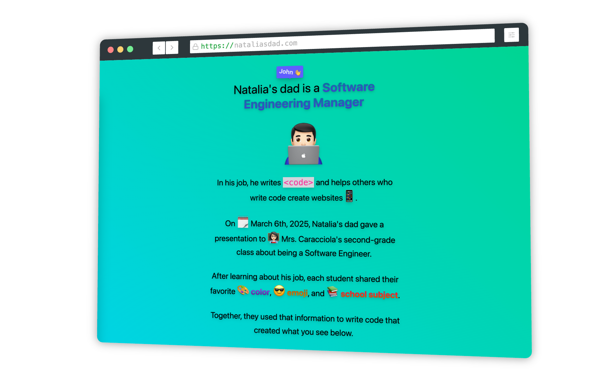

# NataliasDad.com

A website and presentation I built for my daughter’s second-grade class’s Career Week.

* [nataliasdad.com](https://nataliasdad.com/presentation)
* [nataliasdad.com/presentation](https://nataliasdad.com/presentation)



## 📚 Libraries

 * [Astro](https://astro.build/)
 * [Tailwind](https://tailwindcss.com/)
 * [reveal.js](https://revealjs.com/)

## 🚀 Project Structure

Inside of your Astro project, you'll see the following folders and files:

```text
/
├── public/
│   └── favicon.ico
├── src/
│   ├── assets/
│   ├── components/
│   │   └── Tooltip.astro
│   ├── layouts/
│   │   └── Layout.astro
│   └── pages/
│       └── index.astro
│       └── presentation.astro
│   └── scripts/
│       └── confetti.ts
│   └── styles/
│       └── index.css
└── package.json
```

## 🧞 Commands

All commands are run from the root of the project, from a terminal:

| Command                   | Action                                           |
| :------------------------ | :----------------------------------------------- |
| `npm install`             | Installs dependencies                            |
| `npm run dev`             | Starts local dev server at `localhost:4321`      |
| `npm run build`           | Build your production site to `./dist/`          |
| `npm run preview`         | Preview your build locally, before deploying     |
| `npm run astro ...`       | Run CLI commands like `astro add`, `astro check` |
| `npm run astro -- --help` | Get help using the Astro CLI                     |
